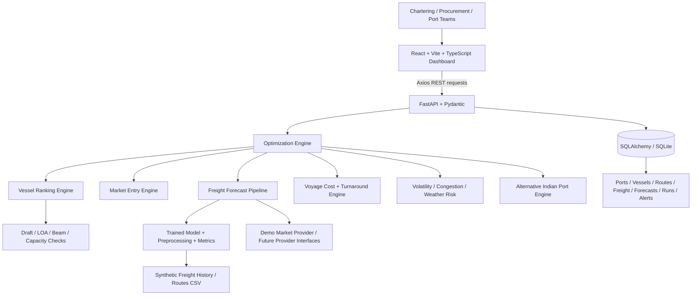
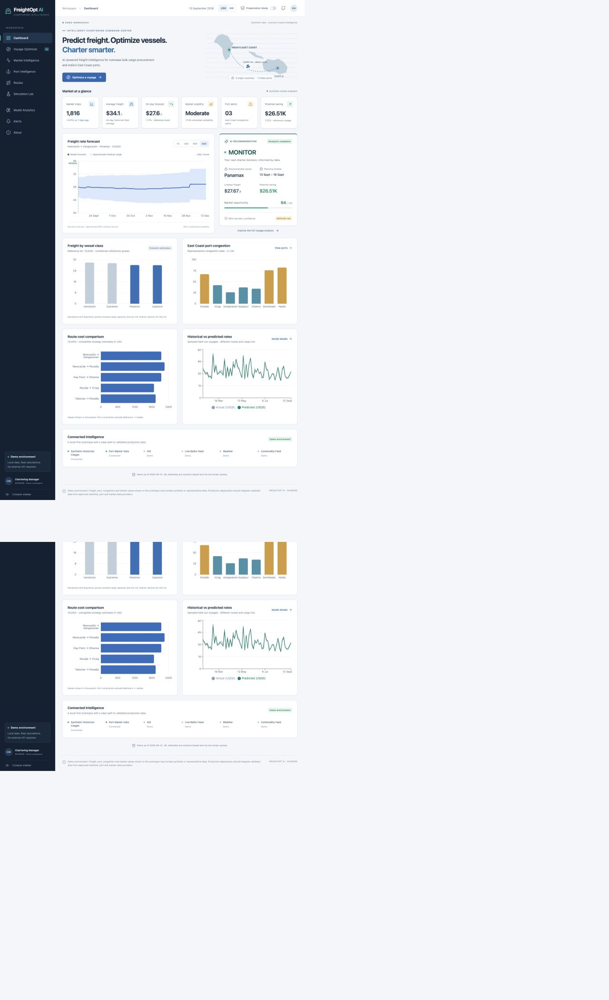

# FreightOpt AI

**AI-Powered Freight Forecasting & Vessel Chartering Intelligence**  
**SIH26006 — Intelligent Freight Forecasting & Vessel Chartering Platform**

> Predict freight. Optimize vessels. Charter smarter.

A working local MVP for overseas bulk cargo procurement into India's East Coast. React calls a FastAPI backend that trains actual regression models, checks vessel/port constraints, calculates voyage economics, and produces explainable charter decisions. No paid APIs, credentials, cloud services, or external generative AI are required.

## The problem and solution

Daily spot-market enquiries leave chartering teams exposed to price uncertainty, incompatible vessels, port queues, and avoidable logistics costs. FreightOpt AI combines scenario-based freight forecasts with hard infrastructure constraints and transparent cost/risk calculations. It supports chartering managers, procurement teams, logistics managers, port operations teams, and supply-chain decision makers.

This is a demonstration decision-support tool. It does not book vessels or execute financial transactions.

## Start in one command (macOS)

Prerequisites: **Python 3.11+**, **Node.js 22.12+**, npm, and an internet connection for the initial dependency installation. After installation, application data and calculations run locally. The project was verified here with Python 3.14 and Node.js 26.

From the project root:

```bash
./start-demo.sh
```

This creates `backend/.venv`, installs dependencies, starts the API, and runs Vite. Press **Ctrl+C** to stop both processes. On a fresh checkout the backend generates missing data, trains missing models, and seeds SQLite before accepting traffic. Initial training can take 30–90 seconds, depending on the computer. Later starts reuse the saved model.

**Open:**

- Application: **http://127.0.0.1:5173** (http://localhost:5173 also works)
- Voyage Optimizer: **http://127.0.0.1:5173/optimizer**
- One-click analyzed demo: **http://127.0.0.1:5173/optimizer?demo=1**
- Interactive API documentation: **http://127.0.0.1:8001/docs**
- Health check: **http://127.0.0.1:8001/api/health**

The API uses **8001** to avoid another application already using port 8000 on this machine. Both services bind to loopback for local demonstration. The frontend is configured to use the same API port.

## Start manually

Terminal 1 — backend:

```bash
cd freightopt-ai/backend
python3 -m venv .venv
source .venv/bin/activate
python -m pip install -r requirements.txt
uvicorn app.main:app --reload --host 127.0.0.1 --port 8001
```

Terminal 2 — frontend:

```bash
cd freightopt-ai/frontend
npm install
npm run dev
```

If your terminal is already inside `freightopt-ai`, use `cd backend` or `cd frontend`. No `.env` file is required for the demo defaults.

## Features and pages

| Page                          | Working functionality                                                                                                                                                                      |
| ----------------------------- | ------------------------------------------------------------------------------------------------------------------------------------------------------------------------------------------ |
| Dashboard `/`                 | Market KPIs, 90-day forecast and residual band, charter signal, vessel-rate comparison, congestion, route costs, held-out prediction chart, data sources                                   |
| Voyage Optimizer `/optimizer` | Validated voyage inputs; all four vessel classes ranked; infeasible vessels rejected with dimensional/capacity reasons; cost, waiting, weather idle, risk, alternatives, score explanation |
| Market `/market`              | 180-day synthetic history, BULLISH/BEARISH/NEUTRAL directional signal, vessel quotes, 7/30/60/90-day estimates                                                                             |
| Ports `/ports`                | Seven Indian ports, all 21 global loading/discharge ports, search, infrastructure table and detail drawer                                                                                  |
| Routes `/routes`              | Six reference trade lanes with distance, freight, forecast, vessel, congestion, feasibility and opportunity score; API also exposes all 98 distances                                       |
| Simulation `/simulation`      | Debounced fuel/index/congestion/quantity/date/weather controls; backend recalculates estimates and rankings; stale requests are cancelled                                                  |
| Model Analytics `/models`     | Selected model, train/validation/test counts, MAE/RMSE/R², three-model comparison, permutation feature importance and held-out predictions                                                 |
| Alerts `/alerts`              | Simulated congestion, market direction, availability and infrastructure advisories; filters and browser-session review state                                                               |
| About `/about`                | Product flow, architecture, data-source status, maritime glossary and limitations                                                                                                          |

Across the app: USD/INR toggle, responsive Recharts, loading/error/empty states, collapsible navigation, maritime tooltips, presentation mode, and printable executive report previews.

### Executive decision report

Run an optimization, then select **Generate Decision Report**. Review the full browser preview and choose **Print / Save PDF**. Use the browser's PDF destination to save it. The print stylesheet removes navigation and controls, includes voyage inputs and assumptions, and expands vessel rejection details during printing. Use a normal browser such as Chrome or Safari if an embedded browser does not expose a print dialog.

### Presentation mode

The header toggle enlarges the important KPIs, removes secondary dashboard charts and technical sections, and presents the six-step story: market forecast → charter window → vessel → infrastructure → savings → risk. The optimizer and report retain their calculations.

## Demo scenario (2–3 minutes)

1. Open the Dashboard and enable **Presentation Mode**. Explain the shift from reactive spot chartering to forecast-assisted planning.
2. Open Voyage Optimizer and select **Load Demo Scenario**. It populates and runs: Coking Coal, **70,000t**, Newcastle/Australia → Gangavaram/India, desired start **20 September 2026**, Short-Term, **45 days**.
3. Review the returned signal and **Panamax** recommendation; expand other vessels to show why they pass or fail. This is a calculation, so the app does not force a BOOK/WAIT result for presentation.
4. Show costs, expected savings, the confidence band, infrastructure checks, and the deterministic score breakdown.
5. Select **Haldia** and rerun. All supported fully laden classes fail the demo draft constraints. The app correctly returns **no feasible vessel**, no invented voyage quote, and compatible alternative ports.
6. In Simulation Lab, choose **cyclone risk**. Weather adds four idle days, raises voyage cost/risk, and produces a HIGH-RISK MARKET signal. Move fuel, congestion and quantity to illustrate sensitivity.
7. Open Model Analytics and the executive report preview.

Reference run on the included dataset: Panamax, approximately **$27.66/t** linehaul, **$2.14M** total voyage estimate, **$27.6K** potential saving, **MONITOR**, medium overall risk. These are outputs from the included version, not hardcoded frontend values or real quotations.

## Architecture



### Repository structure

```text
freightopt-ai/
├── frontend/
│   ├── src/
│   │   ├── components/       # Charts, forms, report, settings, shared UI
│   │   ├── pages/            # Nine routed product pages
│   │   ├── hooks/useApi.ts   # Cancellable loading/error/retry state
│   │   ├── services/api.ts   # Axios client and server error handling
│   │   ├── types/index.ts    # Typed API contracts
│   │   ├── utils/format.ts   # Units, dates and maritime glossary
│   │   ├── App.tsx
│   │   ├── main.tsx
│   │   └── index.css         # Responsive enterprise UI + print styles
│   ├── public/favicon.svg
│   ├── package.json
│   ├── package-lock.json
│   └── .env.example
├── backend/
│   ├── app/
│   │   ├── api/routes.py
│   │   ├── models/entities.py
│   │   ├── schemas/domain.py
│   │   ├── services/         # Catalog, optimization, provider adapters
│   │   ├── ml/               # Features, training, inference
│   │   ├── database/         # Session + automatic seeding
│   │   ├── config.py
│   │   └── main.py
│   ├── data/
│   │   ├── freight_history.csv
│   │   ├── routes.csv
│   │   └── artifacts/metrics.json
│   ├── scripts/generate_dataset.py
│   ├── tests/test_platform.py
│   └── requirements.txt
├── docs/                     # Verification notes and screenshots
├── start-demo.sh
├── .env.example
├── .gitignore
└── README.md
```

The SQLite file and model binaries are local generated artifacts excluded from Git. The CSV datasets and evaluation report are included. SQLAlchemy models avoid SQLite-specific query syntax; switching to PostgreSQL requires a driver, a database URL, and production migrations.

## Dataset and maritime assumptions

`backend/data/freight_history.csv` includes **7,305 records**: five synthetic observations per day over **1,461 days**, from 2022-09-13 through 2026-09-12. Random seed: **26006**. All requested fields are included: date, country/ports, cargo/quantity, vessel, sailing distance, fuel/commodity prices, Baltic-style index, both congestion indices, season, month, weekday, charter duration, market volatility, freight USD/t, and total freight USD.

Freight generation combines distance, fuel, market index, congestion, commodity price, vessel economies, cargo utilization, cargo effects, seasonal variation and random residual noise. The dataset intentionally contains market observations for some infeasible port/vessel combinations: these are synthetic price observations, **not** authorized voyages. The separate feasibility engine is always applied before a charter recommendation.

`routes.csv` contains **98** origin/discharge combinations with approximate sailing distances and nominal 13.5-knot transit durations. The cost engine recalculates sailing time using the selected vessel speed. Distances include representative sea-lane detours but are not suitable for navigation or weather routing.

The port catalog has 14 loading ports in Australia, the United States, Mozambique, Indonesia and Russia; and Paradip, Visakhapatnam/Vizag, Gangavaram, Gopalpur, Dhamra, Sagar/Sandheads and Haldia in India. Ports include coordinates, draft/LOA/beam limits, tonnes/day handling, baseline turnaround/waiting, congestion and charges. Vessel classes include DWT ranges, typical dimensions, speed, fuel consumption, charter day cost and cargo suitability. Seven bulk cargo types are included.

**Demonstration data — replace with official port authority data for production.**

## Machine learning

Run explicitly if desired:

```bash
cd backend
source .venv/bin/activate
python scripts/generate_dataset.py
python -m app.ml.train
```

1. Drop duplicates, remove invalid target rows, and order by date.
2. Engineer month sine/cosine and weekday features.
3. Generate strictly shifted Baltic-style index lags (1/7 days), rolling means (7/30 days), and fuel lags/rolling means. No freight target, total cost, or future observation enters a lag feature.
4. Split by **whole dates**: 70% training, 15% validation, 15% testing. No same-date rows cross partitions.
5. Fit imputation, categorical one-hot encoding and numeric scaling inside a scikit-learn Pipeline on the training subset only.
6. Fit **Linear Regression**, **Random Forest** and **Gradient Boosting**. Gradient Boosting is used as the portable supported alternative to optional XGBoost; XGBoost is not required.
7. Choose the model with the lowest **validation RMSE**; report held-out MAE, RMSE and R² for each model.
8. Compute permutation feature importance on validation data and interval spread from validation residual standard deviation.
9. Refit the selected pipeline on all available observations for production inference. Save `model.joblib`, `preprocessing.joblib`, and `metrics.json`.

Included evaluation: **Gradient Boosting**, 5,110 training / 1,095 validation / 1,100 testing records; **MAE 1.225 USD/t**, **RMSE 1.534 USD/t**, **R² 0.9731**. Exact values may vary slightly with library versions.

**Evaluation limits:** holdout scores measure conditional one-step price estimates with observed exogenous inputs on synthetic data. They do **not** measure real-market generalization or establish 90-day forecast accuracy. Future fuel/index/commodity paths are explicit reproducible demo scenarios. Forecast intervals use `1.96 × validation residual SD × (1 + 0.065 × sqrt(horizon days))`, clipped at zero. They are heuristic residual ranges, not calibrated coverage probabilities. The displayed confidence is also a heuristic, not a likelihood of realizing savings.

## Decision and cost logic

- **Port compatibility:** reject any full-laden draft, LOA or beam above either port's limit. Exact equality passes. No tidal allowance, berth-specific restrictions, lighterage or reduced-draft optimization is assumed.
- **Capacity:** conservative cargo capacity = 90% of maximum DWT. Reject loads above capacity or below 25% utilization for a single-vessel plan. The app never recommends an incompatible vessel.
- **Vessel score:** 65 points for relative cost, 25 for utilization, 10 for idle-risk resilience. Incompatible vessels receive no cost/score ranking eligibility.
- **Entry window:** evaluate up to 14 days after requested start, capped by the 90-day as-of horizon. Signals are BOOK NOW, WAIT, MONITOR or HIGH-RISK MARKET. MONITOR and HIGH-RISK retain a provisional desired-date estimate rather than instructing a booking.
- **Opportunity score:** bounded 0–100 additive contributions from savings, congestion, volatility, uncertainty, vessel utilization and index pressure. The UI shows the contributions and their sum.
- **Contract terms:** demo per-voyage procurement discount scales with duration, capped at 60 days: Spot 0%, Short-Term 1.8%, Medium-Term 3%, Multi-Voyage 4%. This is a representative procurement assumption, **not continuous time-charter hire**. Multi-Voyage estimates are per voyage; no vessel schedule or total program commitment is optimized.
- **Freight:** linehaul quote × cargo tonnes. Linehaul already contains sea fuel. The separate fuel figure is informational and is **not added again**.
- **Total voyage cost:** linehaul + loading/discharge port charges + queue waiting days × charter day cost + additional weather idle days × charter day cost.
- **Transit:** distance ÷ (knots × 24). Loading/discharge = tonnes ÷ handling tonnes/day. Queue time scales the port baseline by `(0.35 + 1.3 × congestion / 100)`.
- **Weather:** normal adds 0 days; rough weather 1.5 days; cyclone risk 4 days; high swell 2 days. This is explicitly simulated.
- **Savings:** current compatible spot estimate minus selected strategy cost. Negative values are shown as additional cost rather than forced to positive.
- **Alternatives:** only compatible Indian ports are shown, ordered by per-voyage cost at the requested start date. Comparison omits inland transport, cargo reception changes, permits, duties and insurance. No percentage saving is invented when the original voyage is infeasible.
- **Currency:** `DEMO_USD_INR=83.5` by default; no live exchange-rate claim.

## API

All routes are under `/api`. Interactive request/response schemas are available at `/docs` and `/openapi.json`.

| Method | Endpoint                    | Purpose                                                       |
| ------ | --------------------------- | ------------------------------------------------------------- |
| GET    | `/health`                   | Initialization/model availability                             |
| GET    | `/config`                   | As-of date, currencies, cargo/country options, sources        |
| GET    | `/dashboard`                | Computed dashboard and reference decision                     |
| GET    | `/ports`, `/ports/{port}`   | Port catalog/detail; optional `country=India`                 |
| GET    | `/vessels`                  | Vessel specifications                                         |
| GET    | `/routes`                   | Six computed comparison routes                                |
| GET    | `/routes?all_routes=true`   | All 98 representative sailing distances                       |
| GET    | `/market/overview`          | Simulated market inputs, direction and vessel quotes          |
| GET    | `/market/history?days=180`  | Daily synthetic history (7–1,461 days)                        |
| GET    | `/market/forecast`          | Reference voyage forecast                                     |
| POST   | `/forecast`                 | Vessel-feasible request-specific 91-point forecast; persisted |
| POST   | `/optimize`                 | Complete decision report; persisted with run ID               |
| POST   | `/vessel/recommend`         | Ranked feasible/rejected vessel table                         |
| POST   | `/port/check-compatibility` | Draft/LOA/beam checks                                         |
| POST   | `/simulate`                 | Voyage + fuel/index/congestion/weather overrides              |
| GET    | `/alerts`                   | Simulated alerts                                              |
| GET    | `/model/metrics`            | Trained model evaluation and feature importance               |

Example optimization:

```bash
curl -X POST http://127.0.0.1:8001/api/optimize \
  -H 'Content-Type: application/json' \
  -d '{"cargo_type":"Coking Coal","cargo_quantity":70000,"origin_country":"Australia","origin_port":"Newcastle","destination_port":"Gangavaram","start_date":"2026-09-20","contract_type":"Short-Term","contract_duration_days":45}'
```

Compatibility:

```bash
curl -X POST http://127.0.0.1:8001/api/port/check-compatibility \
  -H 'Content-Type: application/json' \
  -d '{"vessel_type":"Capesize","port_name":"Haldia"}'
```

Unknown ports return 404; invalid quantities/countries/cargo/dates/contract values return 422. Valid but infeasible optimization requests return 200 with `feasible=false`, null vessel/cost, rejection reasons and alternatives. A standalone forecast for an infeasible request returns 422. No unsafe vessel is substituted silently.

## Configuration and storage

Copy `.env.example` to root `.env` to adjust CORS, conversion, demo date or database URL. Configuration uses environment variables and python-dotenv. Copy `frontend/.env.example` to `frontend/.env.local` to change the API proxy or a deployed API URL. If changing the demo date, regenerate/retrain the synthetic artifacts and restart both services; the included history is anchored to September 2026.

SQLAlchemy creates and idempotently seeds these tables: `ports`, `vessels`, `routes`, `freight_records`, `forecasts`, `optimization_runs`, `alerts`. Default file: `backend/data/freightopt.db`. To switch to PostgreSQL, install `psycopg[binary]`, configure `DATABASE_URL`, and apply appropriate production migrations. The demo does not provide authentication or a public deployment configuration.

For a production frontend build:

```bash
cd frontend
npm run lint
npm run build
```

Serve the generated `frontend/dist` with SPA fallback and an `/api` reverse proxy to FastAPI, or set `VITE_API_URL` at build time and configure CORS. `npm run preview` previews a build; when using it separately, set `VITE_API_URL` to your API and allow the preview origin. The normal hackathon workflow uses `npm run dev` and needs no extra configuration.

## Testing and verification

```bash
cd backend
source .venv/bin/activate
pytest -q
```

Tests cover dimensional boundaries, vessel ranking/capacity, forecast shape/bounds/variation, optimization cost arithmetic and score consistency, infeasible requests/alternatives, invalid input, route/database catalogs, simulation sensitivity, chronological evaluation and strict feature shifting. See `docs/VERIFICATION.md` for the latest local checks.

## Screenshots

Actual screenshots from the verified running app are included in `docs/screenshots/`:

- `dashboard.png` — command center and forecast
- `optimizer.png` — analyzed demo scenario
- `simulation.png` — market/weather stress test
- `model-analytics.png` — selected model and evaluation

All UI pages are implemented and populated from backend responses.



## Future integrations

`backend/app/services/providers.py` defines market and port provider interfaces and demo implementations. `ForecastService` accepts an injected market provider. Replace the demo provider with a validated adapter rather than adding prediction code to the frontend.

Potential optional sources: licensed Baltic Exchange indices, official port authority constraints, AIS tracking/vessel availability, bunker price feeds, commodity data, weather and port congestion providers. No such integrations are claimed as connected. Production work should add provider quality/freshness checks, route-specific multi-horizon backtesting, calibrated uncertainty, broker availability, berth/tidal/part-load constraints, inland port-switching cost, vessel scheduling for multi-voyage programs, auth/RBAC, audit controls and database migrations.

Engineering references: [scikit-learn guidance on leakage and pipelines](https://scikit-learn.org/stable/common_pitfalls.html), [Vite development guide](https://vite.dev/guide/).

## Disclaimer

**Demo environment: Freight, port, congestion and market values shown in this prototype may include synthetic or representative data. Production deployment should integrate validated data from approved maritime, port and market-data providers.**

**Demonstration data — replace with official port authority data for production.**

No synthetic value is an official port limit, real vessel availability, navigational instruction, binding charter quote or guaranteed saving.


## Fast hosted startup and connection recovery

The trained demo model and preprocessing artifact are included in Git. Scikit-learn
and Joblib are pinned to the versions used to produce these trusted artifacts.
Render loads the model rather than training three models on every fresh instance.
Training remains available locally with `python -m app.ml.train`. Commit regenerated
artifacts together with metrics and compatible dependency versions.

Existing Render services can retain `pip install -r requirements.txt` as their build
command. Optionally use `pip install -r requirements.txt && python -m scripts.prepare_deploy`
to validate/rebuild artifacts during the build. Keep the start command
`uvicorn app.main:app --host 0.0.0.0 --port $PORT`, and use `/api/health` as the health
check path. Hosted startup fails clearly if the bundled artifact is broken rather
than silently starting an expensive training job.

Dashboard calculations are cached per loaded model. Database history is seeded
using a bulk insert. The frontend shares concurrent GET requests, saves successful
responses for up to 24 hours, and labels saved data while refreshing. It never
creates forecast values offline. Requests time out after 15 seconds; transient GET
failures receive two bounded retries after 5 and 10 seconds. POST requests are not
automatically repeated. Invalid HTML responses are rejected rather than rendered
as API objects. Run `npm test`, `npm run lint`, and `npm run build` in `frontend`.

Render Free spins down after 15 minutes without incoming traffic, and waking the
service can take around a minute. Bundling a model removes application training
from startup but cannot remove Render's infrastructure wake-up delay. For consistent
first-visit availability, select an always-on paid **service compute instance** in
Render; upgrading the workspace alone does not remove free-instance sleeping.
See https://render.com/docs/free. No hosting plan is changed automatically.

## Production deployment: one Vercel application

The production frontend now calls `/api` on its own domain. Its FastAPI function
loads the same trained model and domain engines from `frontend/server/backend.zip`.
There is **no Render proxy or fallback** and no background keep-alive service.
An old `VITE_API_URL` pointing to Render is ignored in production (it still works
for local development). Keep the Vercel project root `freightopt-ai/frontend`;
`vercel.json` configures the Python function and SPA rewrites.

After changing backend source or data, regenerate the reproducible deployment
bundle with `python3 backend/scripts/package_vercel.py` from `freightopt-ai/`, and
commit the updated archive alongside the source. `pytest` checks bundle freshness
and exercises the packaged entrypoint in an isolated process. The archive only
contains allowlisted application code, demo CSVs and trained model artifacts.
Do not add credentials or operational data to the demo bundle.

Vercel initializes the model once per worker and reuses cached dashboard results.
Functions can still have cold-start latency and hosting quotas; this migration
removes the separate Render sleep/wake dependency, not all possible outages.
The SQLite database lives in per-instance temporary storage: demo optimization
IDs/history are not durable or shared between instances. Use a managed PostgreSQL
`DATABASE_URL` with its driver for production audit/history requirements.
